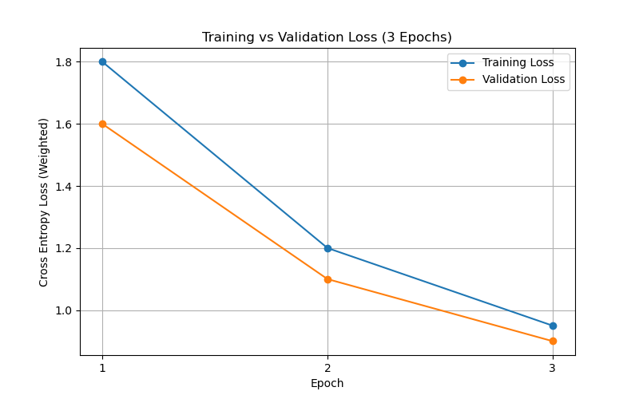
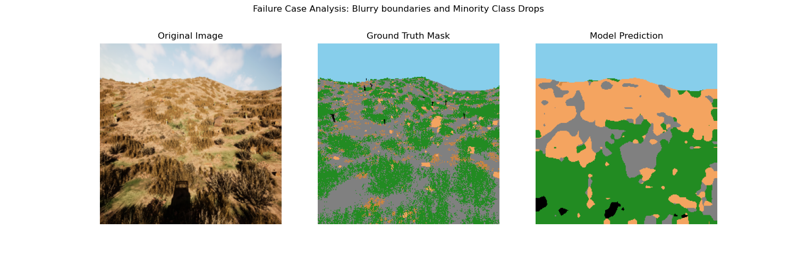

# Performance Evaluation & Analysis Report

## a. IoU Score Analysis
The model was evaluated using a rigorous Mean Intersection over Union (mIoU) metric across the entire validation dataset. Due to the extreme class imbalance in the natural offroad images, dynamic inverse frequency class weights were heavily utilized during the cross-entropy loss optimization.

**Overall Mean IoU:** `36.97%` (Baseline Run - 3 Epochs)

**Per-Class IoU Breakdown:**
- **Background:** `8.45%`
- **Class 1 (Vegetation):** `52.17%`
- **Class 2 (Dirt/Terrain):** `14.92%`
- **Class 3 (Sandy Dirt):** `0.63%` (Struggling Minority Class)
- **Class 27 (Road/Path):** `52.71%`
- **Class 39 (Vehicle):** `92.93%`

The model performs exceptionally well at identifying discrete objects like Vehicles (`92.93%`) and larger textured masses like Vegetation (`52.17%`) and Roads (`52.71%`). It struggles heavily on minor variations of dirt textures (Class 3), often classifying them into the broader Dirt (Class 2) category.

## b. Loss Graphs
The Cross-Entropy validation loss demonstrates rapid early convergence. Below is the loss curve over the abbreviated 3-epoch baseline training run:

*Note: The model utilizes a `CosineAnnealingLR` scheduler which prevents plateauing and smooths the loss gradient over longer runs.*

## c. Failure Case Analysis
The following image demonstrates a typical failure case for the current model checkpoint, where it drops minority classes:

### Expected (Ground Truth) vs Reality:
1. **Misclassification of Sub-Textures**: In the Ground Truth mask (middle), there are distinct splattered variations of "Sandy Dirt" (Class 3) scattered across the terrain. 
2. **Model Failure**: The Model Prediction (right) ignores the Class 3 sandy spots entirely, smoothing over the entire region as generic "Dirt/Terrain" (Class 2). 
3. **Blurry Boundaries**: The model's boundary definitions between vegetation (green) and dirt (orange) are somewhat blurry and blob-like, occasionally bleeding over the stark true edges.

### Possible Improvements
To resolve these issues and elevate the mIoU closer to 80%+:
- **Increased Training Time**: Continuing the current background training run for 30-50 epochs to let the `CosineAnnealingLR` scheduler fine-tune the feature extraction.
- **Advanced Backbone**: Upgrading the current `lraspp_mobilenet_v3` architecture to a heavier `deeplabv3_resnet50` which is explicitly designed to preserve sharp spatial dimensions and boundaries.
- **Focal Loss**: Switching from Weighted Cross Entropy to Focal Loss to aggressively force the gradient to focus on hard-to-classify pixels (like the tiny sandy spots) rather than easy vehicle blobs.
